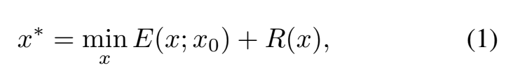
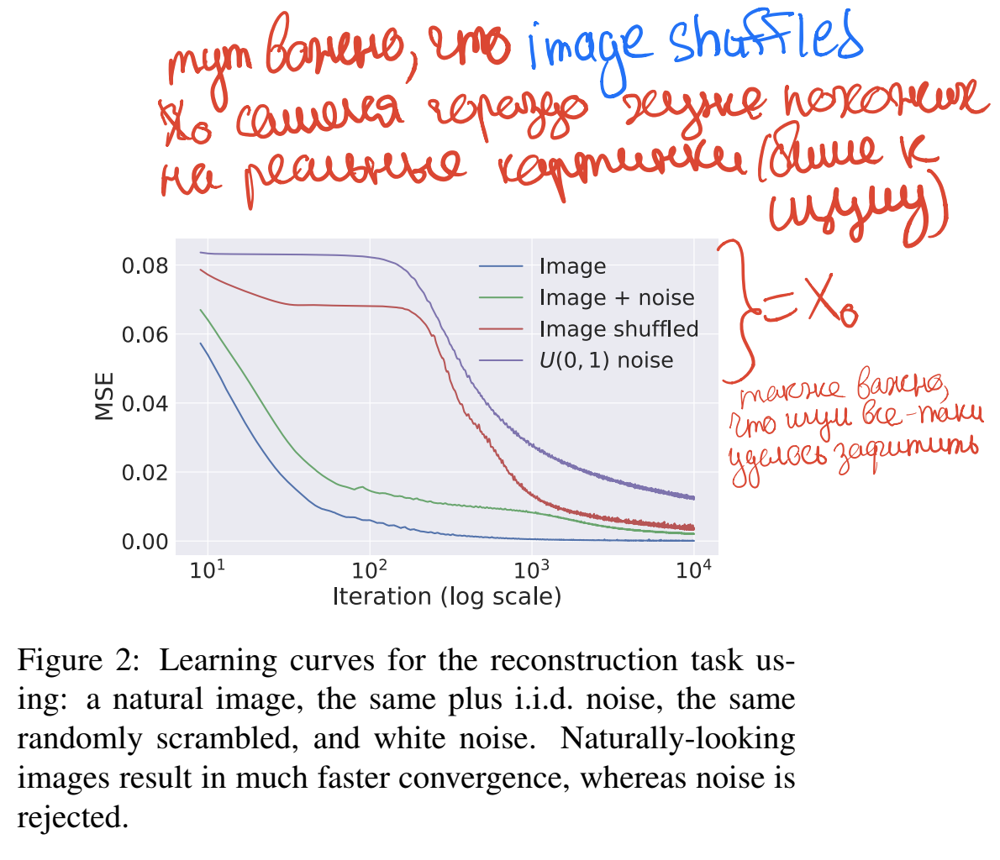

# [Deep Image Prior](https://arxiv.org/abs/1711.10925)

[GDrive pdf with notes](https://drive.google.com/file/d/1X0F5KM-n86Kmc0L9DJaKiStx8SUbil2U/view?usp=sharing)  
[Presentation](https://docs.google.com/presentation/d/e/2PACX-1vT7mbFh-U0bHSmpmhwIifM8pU2ru9g1mJad_OsfQdt9of5LbIURZKCP_UOt1AqVmhmeYad1TPZCSVRQ/pub?start=false&loop=false&delayms=3000)

## TDLR

We can efficiently solving inverse learning task by using only 1 degenerated sample (i.e. corrupted image) and ConvNet generator architecture prior.

## Notes

Any inverse task (super-resolution, inpainting, ...) can be formulated as:

This paper operates as follows: we consider `R(x)` \infty in all points except ones that can be produced from ConvNet `f` feeded with Uniform noize `z`. That is the `Deep Image Prior` thing, which formulated though architecture of `f` net.  

Thing that maters here is numple of visible corrupted samples: 1. We just using single `x_0` image, minizing energy function using SGD with ConvNet generator with Uniform input noize `z`. We optimizing whole network by parameters (weights) of generator `f`. 

As you can see here, real image and image plus noise optimizing and fitting much nicer than arbitrary noise without any connection in between pixels. In other words, the parametrization offers high impedance to noise and low impedance to signal.

Results for different taks show quite comparable quality of resulting sample `x`, obtained by passing (and, probably, averaging at the end) noise `z` to fitted generator.

## Afterword

Actually, this is quite insane result.

## Links

- [TV](https://en.wikipedia.org/wiki/Total_variation_denoising)
- [PSNR](https://en.wikipedia.org/wiki/Peak_signal-to-noise_ratio)
