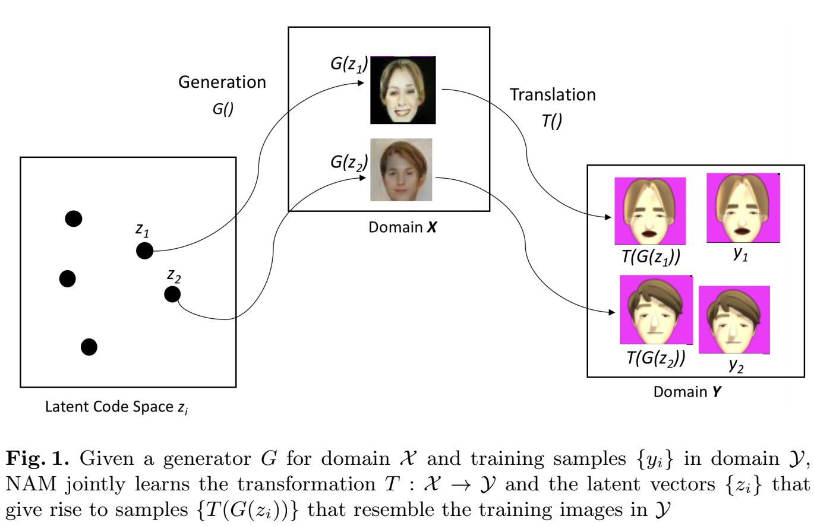
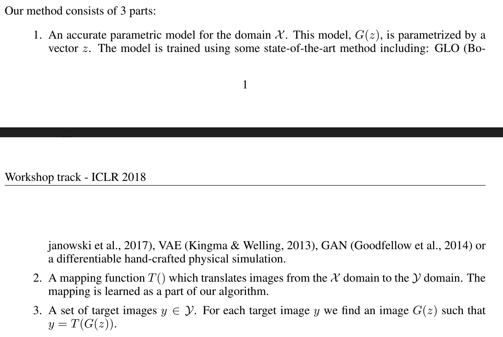
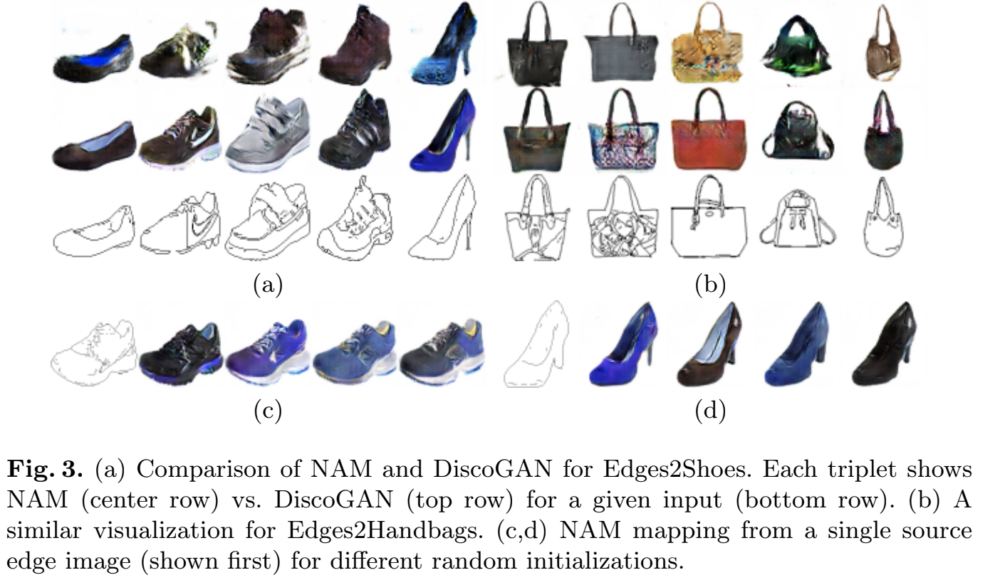
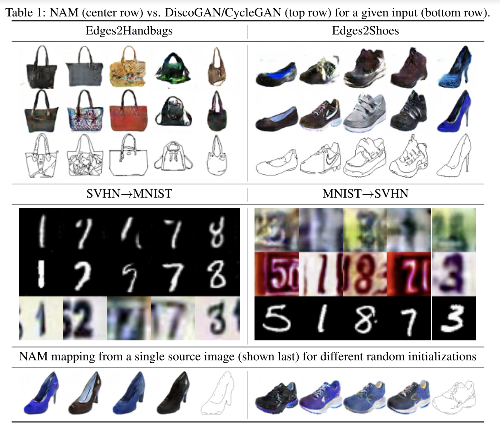

# [NAM: Non-Adversarial Unsupervised Domain Mapping](https://arxiv.org/abs/1806.00804)

[GDrive pdf with notes](https://drive.google.com/drive/u/0/folders/1Afbp-OQLUYlRsHY48M9RkCcR_Ahx1sGf)  
[IMCL draft GDrive pdf with notes](https://drive.google.com/drive/u/0/folders/1Afbp-OQLUYlRsHY48M9RkCcR_Ahx1sGf)

## TDLR

Novel method of unsupervised Image-to-Image translation task without any adversarial losses and cycle-consistensy. NAM, based on GLO idea of latent code `z` optimization, provide more robust, simple and fater learning process compared to SOTA approaches.

## Notes

What we gonna do is obtaining a transform `T` (ConvNet, parametrized by set of weights), which map an image `x` from one domain to `y` from another domain. Following GLO paper, we take best (pretrained) `G` generator for `X` domain, which ideally satisfied certain conditions:

* For every `x` from train dataset: there is a `z` such that `G(z) = x`
* For every `z`: `X` includes `G(z)`

Transformation `T` is need for mapping generated `x` sample to the other domain, which is then should located near existing sample `y`:

We gonna optimize `T` and `z`, minimizing following equation (`VGG` loss is actually the Perceptual loss from one prominent paper):

The whole method operates in 3 stages:

We freeze `G` weights after first stage and freeze `T` after second one. At third stage, we be able to obtaining bunch of `z` latent codes as a final result of optimization process starting with different initialization. Thus, we be able to obtain bunch of `x` mapping variants for single `y`:

What also interesting about generating process is:

The results are quite nice, significantly beating CycleGAN metrics.

The notably difference with previous approaches is the training process. We dont play with adversarial losses or cycle-consistency, so training goes more stable and simple.

## Afterword

This could be good base solution for building good domain adaptation method with similar convergence features.

## Links

- [GLO](https://arxiv.org/abs/1707.05776)
- [Perceptual Loss](https://arxiv.org/abs/1603.08155)
