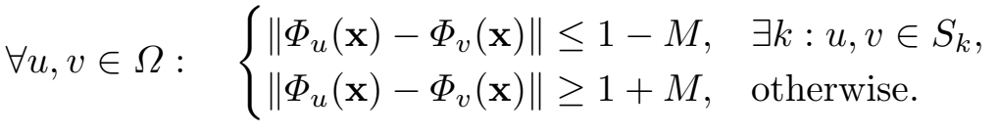
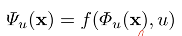
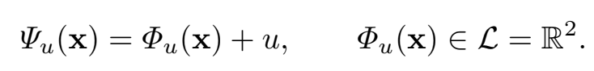
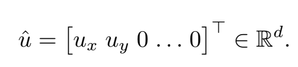
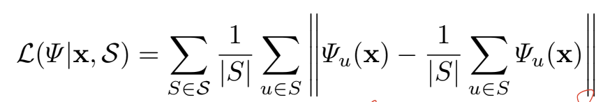
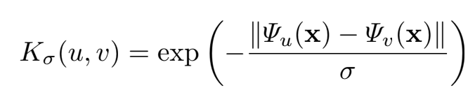
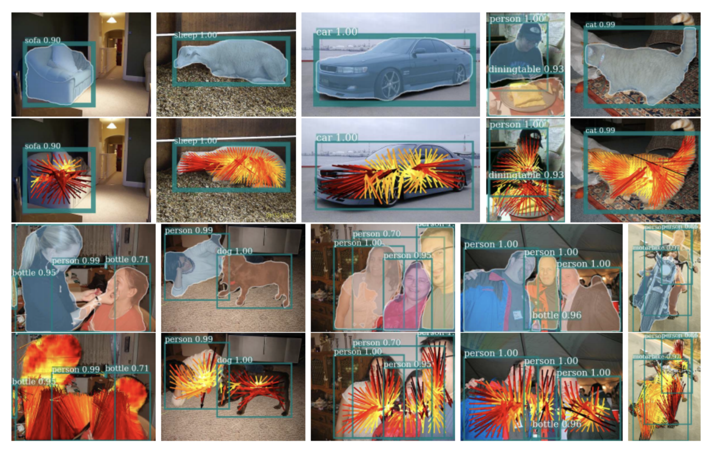
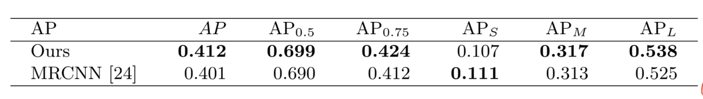

# [Semi-convolutional Operators for Instance Segmentation](https://arxiv.org/abs/1807.10712)

[GDrive pdf with notes](https://drive.google.com/file/d/1dpS5JCiPU9zHOGXCg6gdqsdl2X7zNXij/view?usp=sharing)

## TDLR

Introducing new approarch for instance segmentation task as an extension to Instance Coloring methods family, which help dealing with complex instance location cases, based on idea on Non-Conv operators (rather simple additive extension of Conv once with using of spatial information).

## Notes

There are two major approaches for doing instance segmentation task at the moment. One related to Propose & Verify (PV) strategy, which firsly proposed set of candidate regions and then performing segmentation on each of them (often performing in non-end-to-end mode with IoU tresholding and non-maximum suppression), and Instance Coloring (IC), which assing an embedding for each pixel of input image which can be used to separate instances using distance info, i.e. clustering (thus, embedding should be separable with some theshold `M`):

The latter one is more farourable in terms of end-to-end learning strategy and ability to generalize to similar tasks, but still less accurate then PV. It can be proven, that some complex instance ground-truth cases is hard or even impossible to tackle with standard translation invariant conv operators. Thus, it is proposed a new way to approach this task using Non-Conv operations, which is extent conv embeding with spatial pixel info `u` (some examples with different embedding size >= 2):

Loss function choose is based on good clustering idea i.e. pixels, inside same cluster should be near the cluster center (cluster mean):

To make model more robust to outliers, we also want to change distance between embeddings from L2 to based on Laplassian kernel with trainable sigma parametr:

The paper also proposed simple MRCNN extension, which is using end-to-end training with choosing seed point (as a expecation of all other embeddings with softmax weights based on points likelihood) and performing instance segmentaion with clustering based distance info to seed points.

Pascal VOC 2012 results:

## Afterword

This is helping with complex instance segmentaion, but this is also an incremental improving, which is not yet tested for variety range of datasets, including most popular once.

## Links

- [Hough transform](https://en.wikipedia.org/wiki/Hough_transform)
- [Bilateral filter](https://en.wikipedia.org/wiki/Bilateral_filter)
