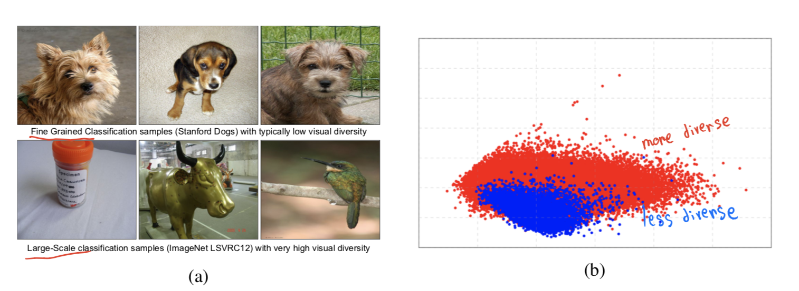
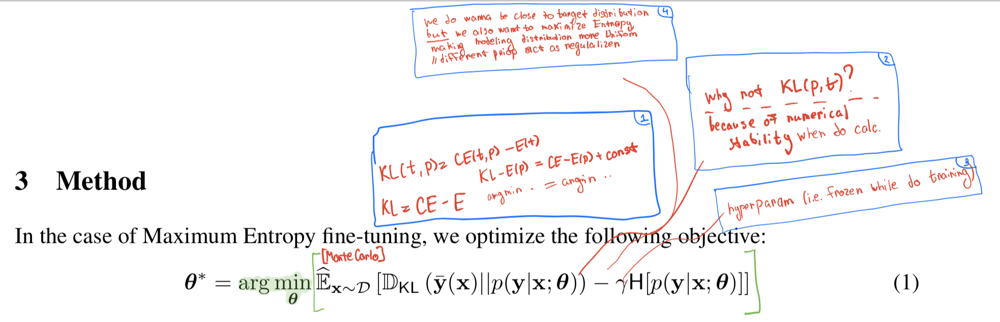
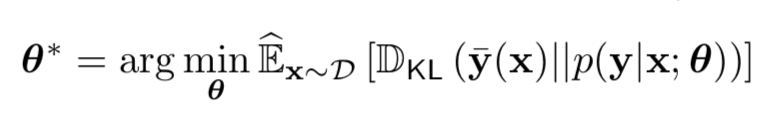
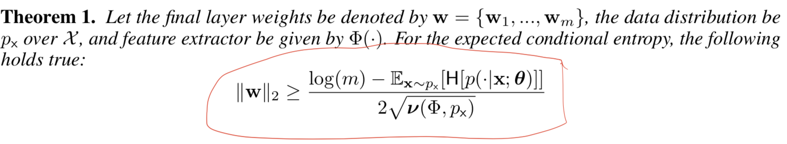
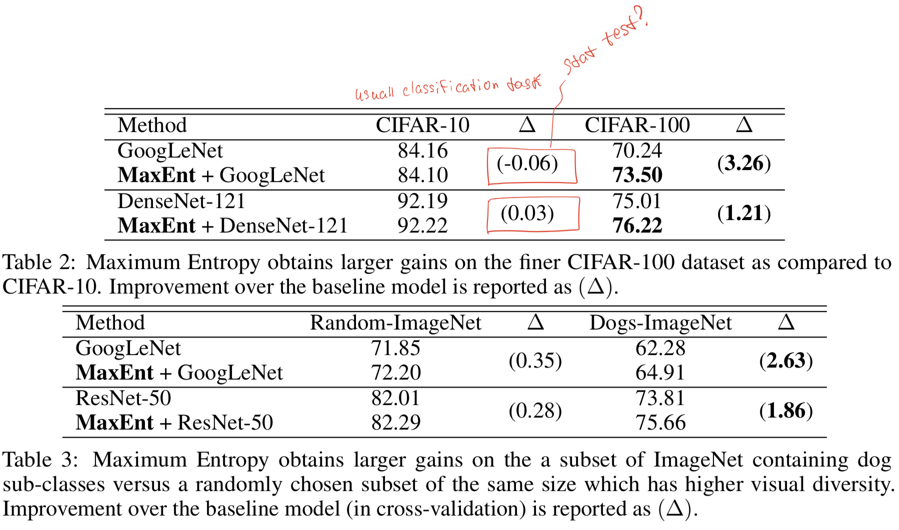

# [Maximum-Entropy Fine-Grained Classification](https://arxiv.org/abs/1809.05934v1)

[GDrive pdf with notes](https://drive.google.com/file/d/1mGBL3rFO0d-H842GNYjb428sdF4qsVbV/view?usp=sharing)

## TDLR

We can archive stable and robust increasing in Fine-Grained classification performance by exploiting the idea of maximum entropy learning. The paper also does some theoritical boundaries on norm of last FC layer, which include feature extractor diversity as parametr, showing that indeed MEL has a strong reason to be succesfull for a particular task.

## Notes

This papers considers a Fine-Grained Visual Classification (FGVC) task, involves small diversity within classes of dataset. Right picture shows PCA2 projection for ImageNet (red) and CUB-200-2011 FGVC (blue):

The whole MEL principle could be described in this one formula:

Modifing hyperparammeter `𝛾` you can alter how much we want to preserve peakiness or regularize distribution to look closer to Uniform (thus, preserving ability to generalize better).

The training of CNN combined with MEL principle, described in the paper, performes in two stages. Firstly, we just tuned network over whole dataset (we can also skip this part and take pretrained net):

Second stage is a fine-tuning stage with full MEL formula. We continue to fine-tuned feature mapping (the one before last FC layer) with large training set (i.e. ImageNet), but only tune last layers weights when doing SGD step over batch of smaller dataset (the Fine-Grained dataset with less diversity).

The ability to generalize well enought depends on norm of last (most important) layer of CNN. The paper shows theoretically, that following equation holds true (with some fair assumptions, such as FE should be muxture of `m` Gaussians):

... where `𝒗(.)` is defined as diversity of FE on given data (sum of eigenvalues of variance of FE(p(X))). Omitting the details and putting it simple, this means that less diversity you have more you want to move to maximum entropy value. 

The proposed method shows comparative performance on default classification task on CIFAR-10, but significaly outperformes SOTA results on Fine-Grained version of same dataset name CIFAR-100:

## Afterword

The result is't astonishing and rather predictable, still theoretical boudaries could give us some insight on how dataset's diversity affects learning process.

## Links

- [Principle of maximum entropy, MEL](https://en.wikipedia.org/wiki/Principle_of_maximum_entropy)
