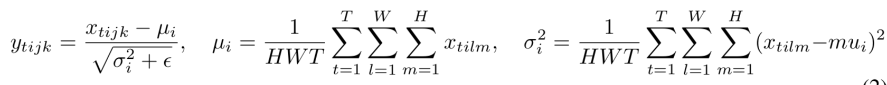
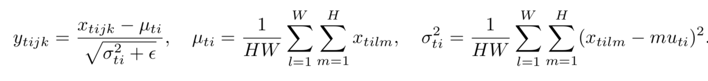
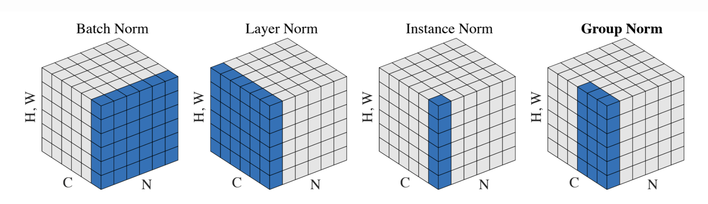
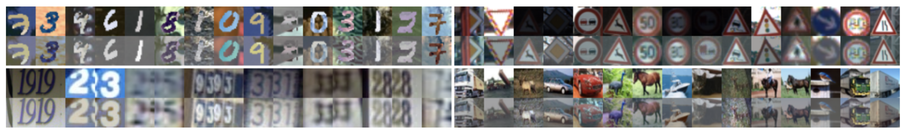

# [Instance Normalization: The Missing Ingredient for Fast Stylization](https://arxiv.org/abs/1607.08022)

[GDrive pdf with notes](https://drive.google.com/file/d/116Kig999P0LgiBn2wIGE9bbmcZkPyI98/view?usp=sharing)

## TDLR

For style-transfer tasks, we urge to have efficient constrast normalization layer, which can be implemented better via novel the Intance Normalization (IN) layers opposed to the Batch Normalization (BN) one.

## Notes

### Idea

Batch Norm:

Instance norm:

Visually:

### Result of applying

## Afterword

Very simple, but quire powerfull norm method for style-transfer tasks.

## Links

- [Neural network normalization](https://nealjean.com/ml/neural-network-normalization/)
