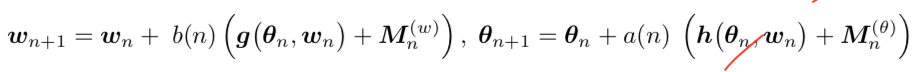
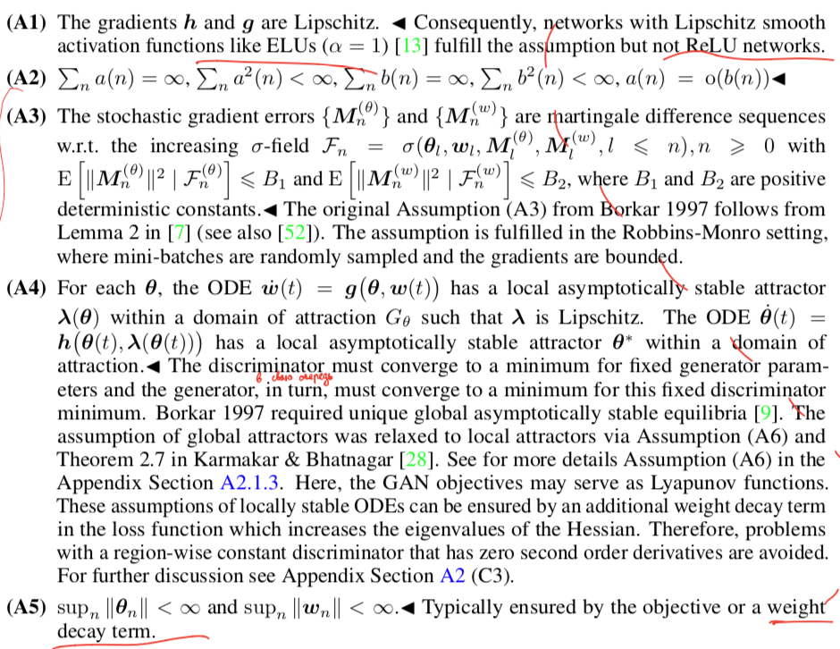
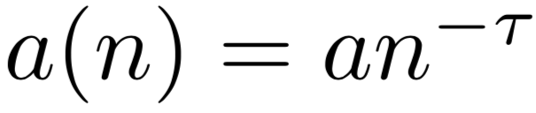
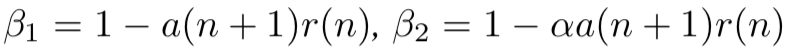
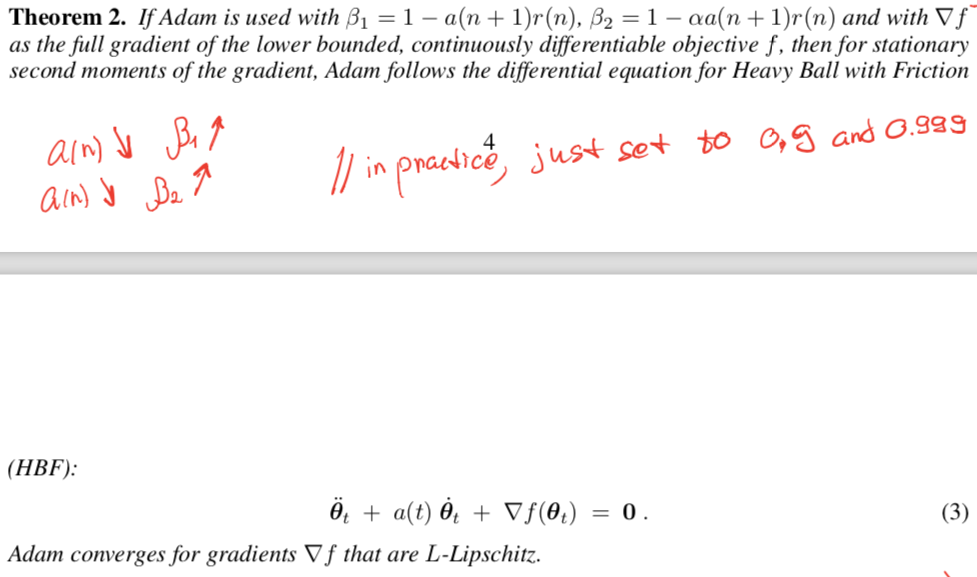
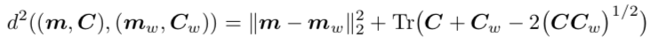
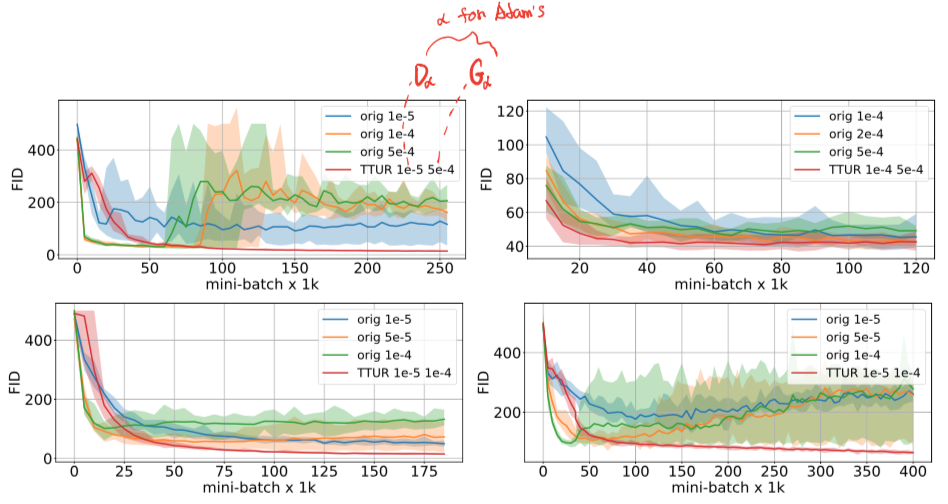
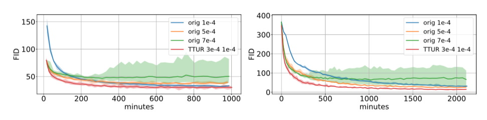

# [GANs Trained by a Two Time-Scale Update Rule Converge to a Local Nash Equilibrium](https://arxiv.org/abs/1706.08500)

[GDrive pdf with notes](https://drive.google.com/file/d/1jd0JJbO3lCwuFYsafRiFs9kqNtjdv47y/view?usp=sharing)

## TDLR

Paper proposed a novel two time-scale update rule (TTUR) for optimizing GAN game between Discriminator `D` and Generator `G`. For some mild assumptions, it also proves convergence to a stationary local Nash equilibrium. Second result - Frechet Inception Distance (FID) - new wasserstein-2 based metrics between moments of `p_{data}` and `p_G` distributions to measure GAN performance that outperforms previous Inseption score in terms of correlation with human perception. 

## Notes

Let's start with describing TTUR result. Starting from the simple GAN optimization, we intend to change optimizing steps into two separate ones:

We also want some assumptions kept (A1-A5):

The most important here is A1: note, that we don't want to use ReLU activation, since it has't Lipschitz gradient (easy to prove). A2-A5 easy to observe when using Adam optimizer with decaying learning rate.

To be able to prove convergence to local Nash Equilibrium, we also need adjust some parameters for Adam optimizer step. If we take following parameters:

  

for single step number `n`, we now can prove following theorem:

which finishes the whole point. Indeed, we taking two optimization step simultaneously, we be able to converge to stationary points for both of `D` and `G`, which is the very definition of local NE.  

Another good result is introduction of FID to measure performace of generative models. The whole idea is base on calculating some distance between real distribution `p_{data}` and modeling one `p_G`, obtained after GAN game convergence. Authors take Wasserstein-2 distance after obtaining meand and std values (1 and 2 order moments) between the Gaussian distribution with this parameters (since it has maximum entropy value possible):

How simple is that? But it tends to be more consistent with the noise level than the Inception Score!

The results are quite interesting. We can observe significantly more stable optimization process in comparison to simple one-time scale step for DCGAN for different learning rates:

Same for WGAN-GP, which is SOTA approach for GAN training by the way:

**Again, note here that we still need to find learning rate manually!**

## Afterword

TTUR indeed provide a good approach for optimization with separate adjustable learning rates for `D` and `G` (under mild assumptions), but is also does't save us from choosing learning rates itself. FID score is good enough in comparison to Inseption one, no doubt about it.

## Links

- [Inseption Score](https://arxiv.org/abs/1606.03498)
- [Wasserstein metric](https://en.wikipedia.org/wiki/Wasserstein_metric)
