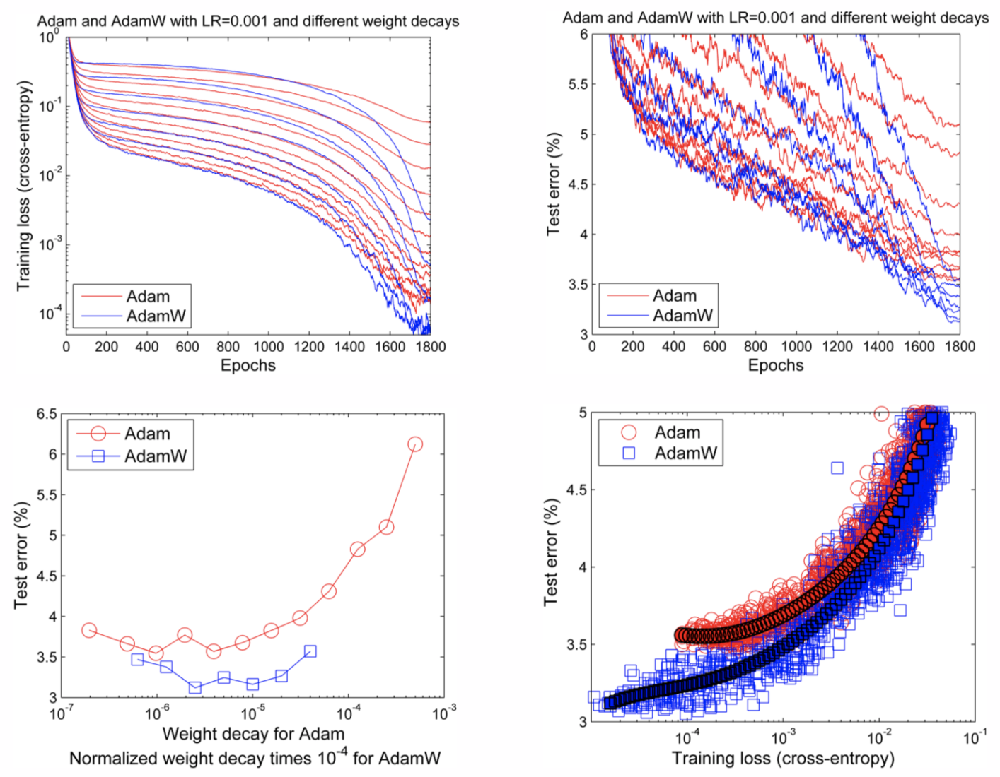

# [Fixing Weight Decay Regularization in Adam](https://arxiv.org/abs/1711.05101)

[GDrive pdf with notes](https://drive.google.com/file/d/1RCWtYMULFYDauZPuRFSk7XIuhKOpDBEF/view?usp=sharing)

## TDLR

Novel optimizer approach based on fixing weight decay regularization in Adam, which generalize a bit better on varierty of tasks.

## Notes

### Idea

Authors start with first notting that `L2` and weight decay regularization are't identical for paricular cases. For `SGD`, one need to be rescaled to match the other:

At the moment, `Adam` can't really beat `SGD` with momentum in classification tasks due to lack of ability to generalize well enough. While comparing different regularizing techniques for `Adam`, one can note that weight decay term can't be compared to `L2`:

Therefore, introducing weight decay inside `Adam` (`AdamW`) can performs better in tasks involving the nessecity of extensive regularization. This stetement will be proven empirically futher in paper.

Yet another results - `AdamWR` implementation, which introduce [warm restarts with annealing](https://arxiv.org/abs/1608.03983) into `AdamW` optimizer.

Experiments show, that `AdamW` gains more generalization power in variety of tasks.

### Result

## Afterword

Simple, yet effective extension, which yet need to be put into test.

## Links

- [Adam](https://arxiv.org/abs/1412.6980)
- [PyTorch implementation](https://github.com/egg-west/AdamW-pytorch)