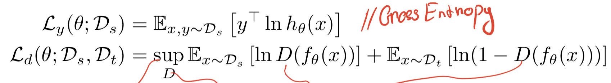
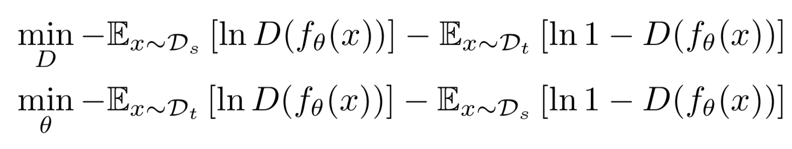
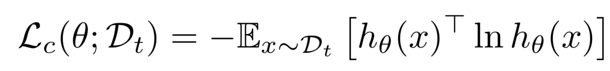
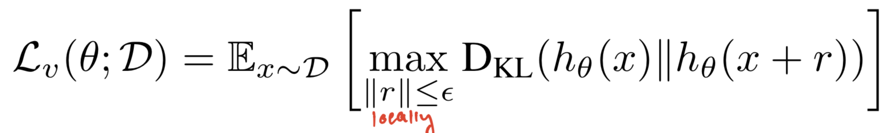
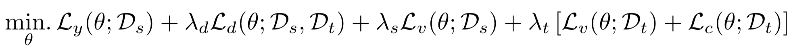
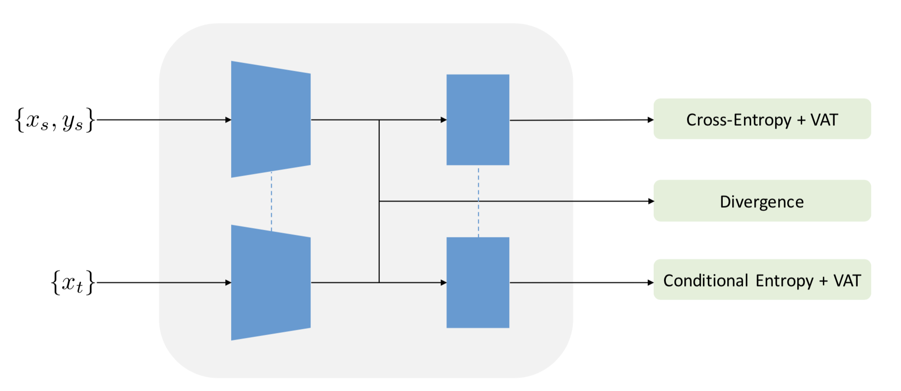
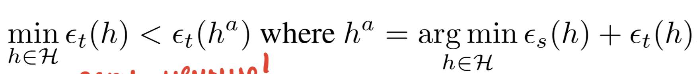
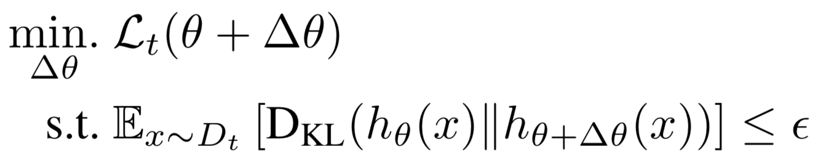
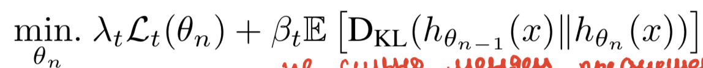
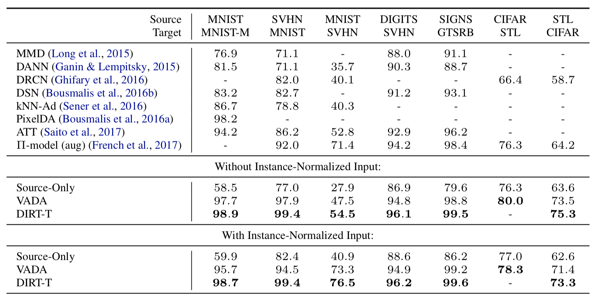

# [A DIRT-T Approach to Unsupervised Domain Adaptation](https://arxiv.org/abs/1802.08735)

[GDrive pdf with notes](https://drive.google.com/file/d/1gknzxL9W7RlIJXov0E_GYDg1Fi3QCuwS/view?usp=sharing)

## TDLR

2 novel approaches for the Domain Adaptation task as an extension of [RevGrad](https://arxiv.org/abs/1409.7495) idea with addititional losses derived from cluster assumtion (VADA) and refinement step for solely minimization the target-side cluster assumption violation (DIRT-T). 

## Notes

### VADA

Let's take RevGrad idea as an initial point to start from. Firstly, we want to redefine optimization problem:

for adversarial optimization, since gradient reversal layer with simple cross entropy cant really lead to good solution with large feature space (shown empirically):

Now, we also want to apply the cluster assumption to domain adaptation (i.e. input distribution X contains clusters and that points in the same cluster come from the same class). If the cluster assumption holds, the optimal decision boundaries should occur far away from data-dense regions in the space of `X`. For this to work, we want to make prediction on `X_t` part of data more sparse by adding new loss, thus:

It can be also shown, that conditional entropy estimate breaks down if classifier is't locally-Lipschitz, which leads to allows placement of the classifier decision boundaries close to the training samples even when the empirical conditional entropy is minimized. Thus, we want to enforce locally-Lipschitz constaint in area around by:

The whole new objective for classifier now looks like this:

And overall picture for clarity:

### DIRT-T

Now, let's talk about DIRT-T refinement step, which comes from following new assumtion:

i.e. we can find better hypotesis for explain `X_t` than while we doint optimization for both parts of data. 

Thus, we operates as follows. We firstly initialized model with VADA. Insofar as VADA is trained on the source domain, we hypothesize that a better hypothesis is achievable by introducing a secondary training phase that solely minimizes the target-side cluster assumption violation. We want to continue minimize `L_t` loss using gradient steps, while also preserving the decision boundaries:

The corresponding Langrangian suggests following optimizing steps:

which can be solves via a finite number of SGD steps.

### Results

Results (instance norm applied as first layer):

## Afterword

This method got insane performace gain for common simple datasets, yet this still relatively easy to train (compare to [CyCADA](https://arxiv.org/abs/1711.03213) tonns of hyperparameters to chooose). Could this be extend to more complicated tasks and datasets, like segmentation one?

## Links

- [Lagrangian](https://en.wikipedia.org/wiki/Lagrange_multiplier)
