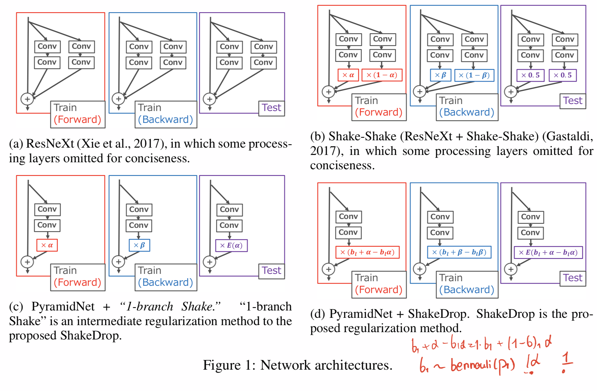
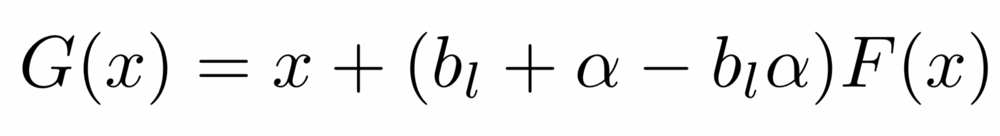
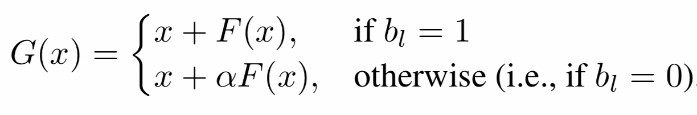
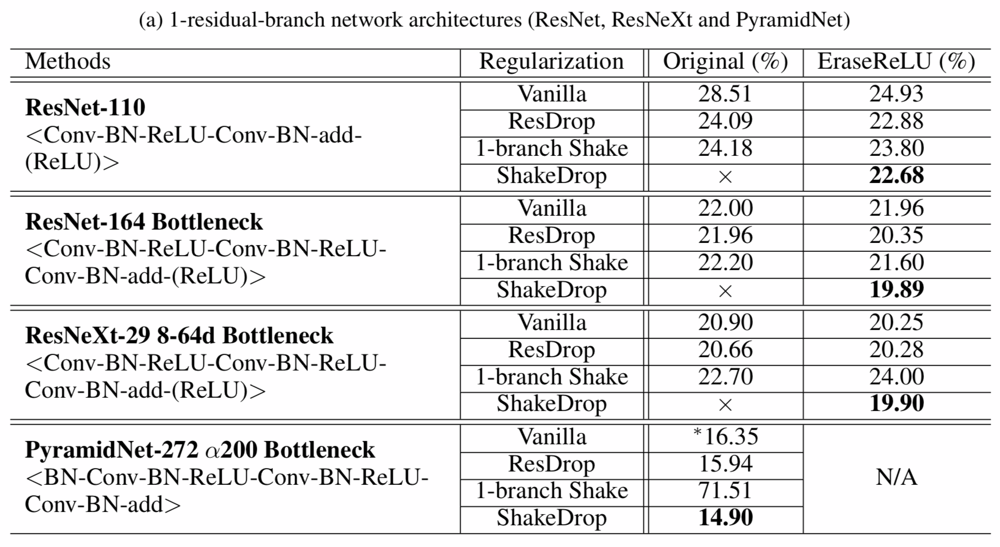

# [ShakeDrop Regularization](https://arxiv.org/abs/1802.02375)

[GDrive pdf with notes](https://drive.google.com/file/d/1E3K3yIA_xl2dEkqGIvReDZ1IDt0v40IA/view?usp=sharing)

## TDLR

This paper proposes a powerful regularization method named ShakeDrop regularization. ShakeDrop is inspired by ShakeShake regularization that decreases error rates by disturbing learning.

## Notes

### Idea

`ResNet` is powerfull base model for different tasks in Deep Learning so far. Two particular are `ResNetX` and `PyramidNet`, which supported many etxension on introducing stohasticity inside skip connection block. Paper's novel approach is base on success of `ShakeShake` one extension to one branch of `PyramidNet`, like depicted on following picture:

where `b_l` is Bernoulli random variable with probabilty of `p_l` as hyperparametr. Thus, the proposed `ShakeDrop` transformation given as:

 

### Result

## Afterword

The improvement seems like incremental change. It is plausible to see more skip connection extensions like these in near future.

## Links

- [ShakeShake](https://arxiv.org/abs/1705.07485)