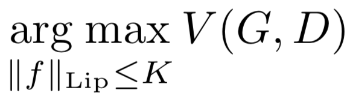

# [Spectral Normalization for Generative Adversarial Networks](https://arxiv.org/abs/1802.05957)

[GDrive pdf with notes](https://drive.google.com/file/d/1knOTOwtqx_WTqBYRWCZkBjaS971_mDmw/view?usp=sharing)

## TDLR

Nover approach for regularizing gradients for discriminator network in GAN game, which tends to be simple yet powerful analogue to weight normalization and gradient penalty.

## Notes

The proposed approach is simple enough. Let's consider discriminator as stack of linear layers with following sigmoid activation:

It's well known that optimal `D` for given `G` is player by such formula:

Thus, the gradient of layers `f` could be formulated as follows:

which can be unbounded of even incomputable (also tends to be unstable during training). Thus, our desire is to imply some regularization on `D`. This could be done, for example, with conditioning on Lipschitz continuity of `f` while doing whole optimization (this bounds our gradients in every direction):

To be able to do that, we firstly need to make some bounds of Lipschitzing of `f`. With activation functions of spectral norm one (fe: ReLU), it could be proved that following inequality holds:

Thus, the only thing we left to do to restrict Lipschitz const (let's say `K=1` for a moment) is to be able to calculate spectral norm `sigma(W)`, since we can normalazing all set of weights like that:

in-place before doing optimizing step (this makes last term exactly one).

So, to be able to do that fast and simple, approximation of spectral norm was proposed. Starting from the initial sampling of singular vectors, we than iteratively update then while also updating weights itself:

Authors got SOTA result in comparison to various GAN optimizing approaches in both Inception score and FID:

## Afterword

Simple, easy to implement, yet results are quite good, but need to be put in test at practice.

## Links

- [Lipschitz continuity](https://en.wikipedia.org/wiki/Lipschitz_continuity)
- [Spectral norm](http://mathworld.wolfram.com/SpectralNorm.html)
- [WGAN-GP](https://arxiv.org/abs/1704.00028)
- [Pytorch implementation](https://github.com/heykeetae/Self-Attention-GAN/blob/master/spectral.py)
