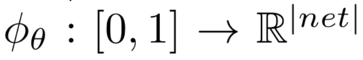
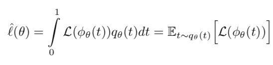
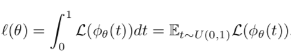
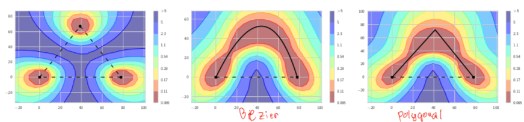
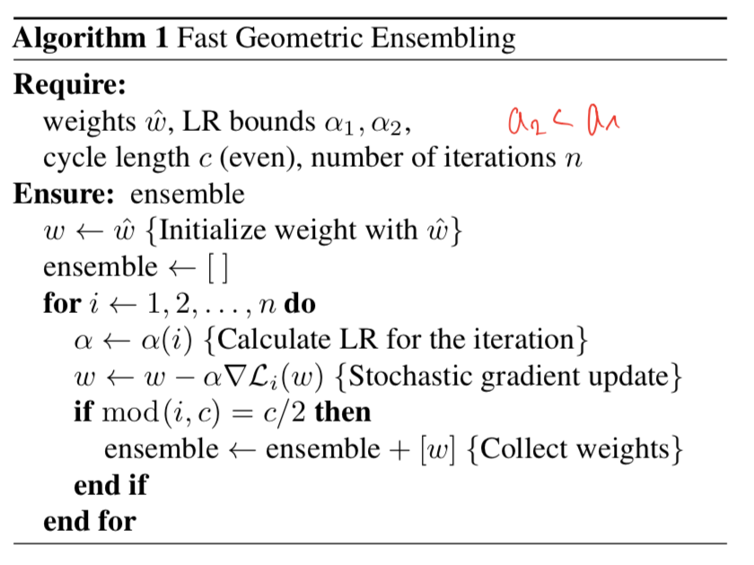
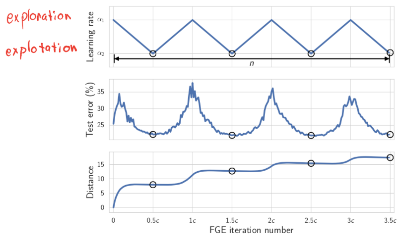
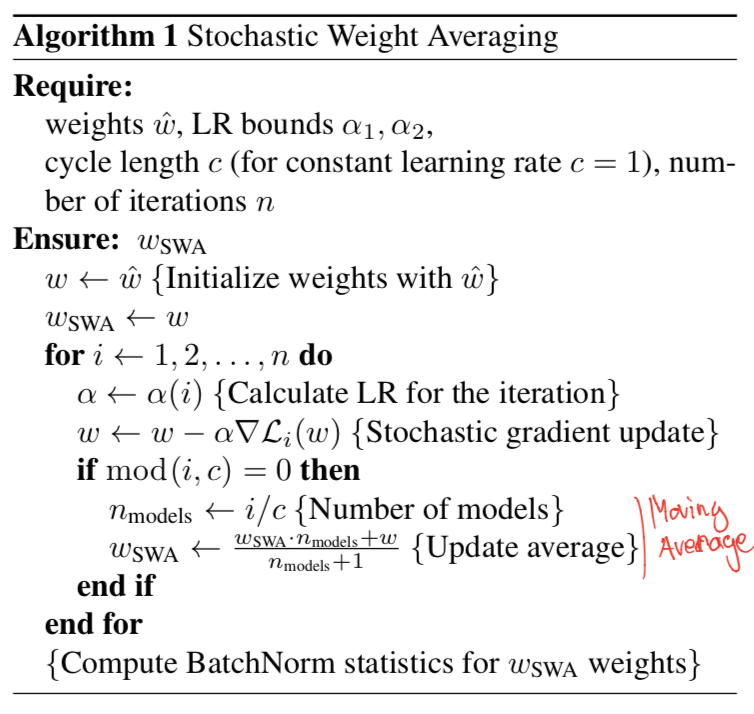
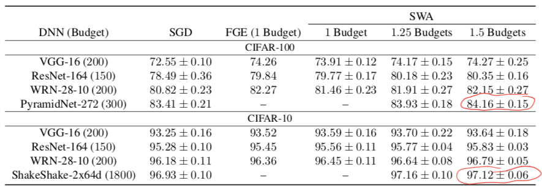

# [Loss Surfaces, Mode Connectivity, and Fast Ensembling of DNNs](https://arxiv.org/abs/1802.10026); [Averaging Weights Leads to Wider Optima and Better Generalization](https://arxiv.org/abs/1803.05407)

[GDrive pdf with notes on FGE](https://drive.google.com/file/d/1U9v4d29y2U4W4-kH8XgW9wiIwO3zQq11/view?usp=sharing)  
[GDrive pdf with notes on SWA](https://drive.google.com/file/d/1-qdaIm5D1nWXT9i5MpMUamC5JPP8OhIS/view?usp=sharing)

## TDLR

Authors proposed a novel method to ensemble networks effectifly by aweraging results from multiple loss local minimums around pretrained one. Heavily inspired by SSE result, it esily could give significant performace increasing, resulting in stable and efficient method for optimizing NN in general case.

## Notes

Let's start with describing FGE result first. Assuming we have two local munimuns set of weights `w_1` and `w_2`. Let us find a pathway between then (in loss surface), which preserve low loss value. We gonna do that by introduce a path way func:

which parametrized by set of new weights. What we want to do is optimize expectation of loss value along the way:

This looks intractable. However, for some cased (path as polygonal chain with single bend) this can be rewritten as:

which is optimizing easily using MC approximation for gradients. Thus, we can obtain desirable path, which is depicted at following picture:

The analysis of result gives some insights on how we can proceed with ensembling: we take around 50 checkpoints along the curve and average the predictions of them, which lead in test error fall in around 1%. However, directly ensembling on the curves requires additional passed for each of one of them (plus, doing some rescailing), which is not desired for effictive ensemble approach. But is proves the point: we could get performace gain by averaging with weights around local optimum.  

Thus, the new algotithm was proposed:

What we do here is changing a learning rate from "big" one to smaller in cycles length `c` to effectively alternate between exploration and explotation stages in process of finding new local minimum. The resulting set of weights `ensemble` then used for averaging predictions at test time.  

In continue with research on ensembling, the new approach was proposed at the following paper on SWA. Moving straight to the point:

Note, the only difference here is insted of collecting every set of weights, corresponding to cycle local minimum, we calculating average point for weights on-the-fly. We do not need average predictions anymore in test time since we only obtain one flat local minimum, resulting in faster inference time. In fact, this approach can be considered as general case for former one (details in 3.5 section).  

One table is really enough for results of both proposed methods:

## Afterword

The whole alghorithm is rather simple and yet effictive, which gives so many  exciting directions for future research on ensembling in loss surface.

## Links

- [SSE](https://arxiv.org/abs/1704.00109)
- [Bézier curve](https://en.wikipedia.org/wiki/Bézier_curve)
- [Pytorch implementation](https://github.com/pytorch/contrib/blob/master/torchcontrib/optim/swa.py)
