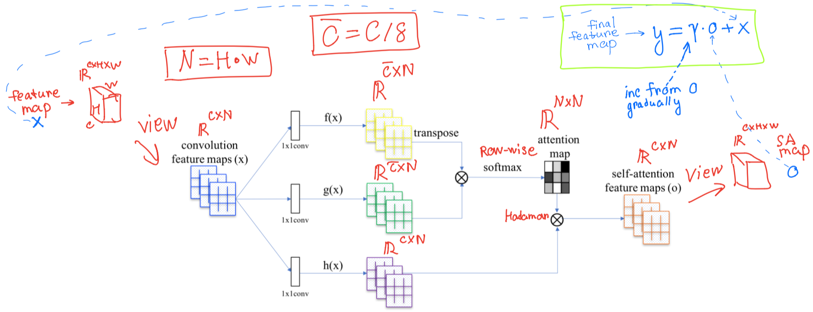
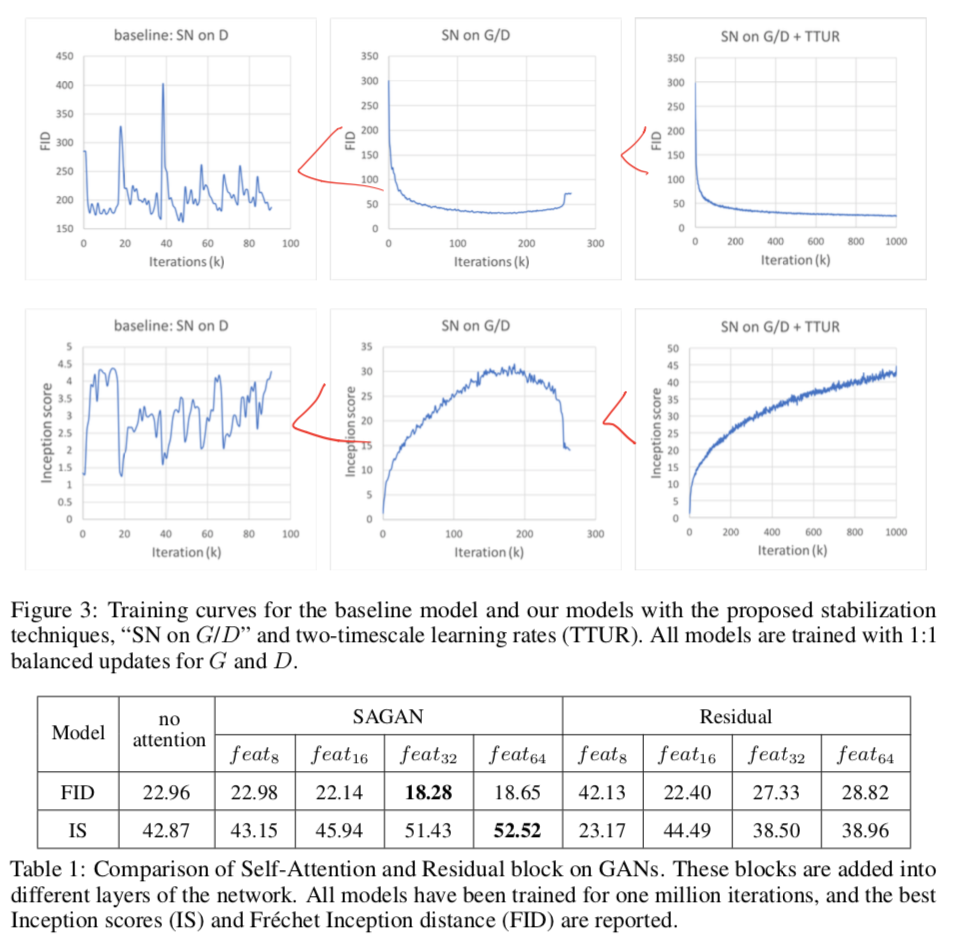
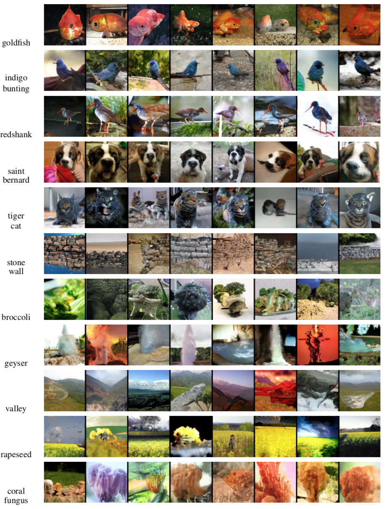

# [Self-Attention Generative Adversarial Networks](https://arxiv.org/abs/1805.08318)

[GDrive pdf with notes](https://drive.google.com/file/d/1zaXwgbswrKpgaHiy9gcemvO8WlmwkL3V/view?usp=sharing)

## TDLR

SOTA GAN model based on the prominent Self-Attention mechanism incorporated inside both Discriminator `D` and Generator `G` architectures to exhibit a better balance between ability to model long-range dependencies and computational and statistical efficiency.

## Notes

Let's got straight to the point. Overall, the architecture for one Attention block (feature map in, feature map out) depicted as follows:

Here we got 3 separate 1x1 conv transforms, 2 of which used to form an attention map and the last one as standard conv apply map to. The input map also passes to the very output (like in ResNet), providing ability to control balance between learning long-term complex dependencies within attention mechanism and not doing that (thus, stick to the local one, since conv operation tends to fail at capturing global deps).  

Authors used Conditional GAN to test the idea. They also exploiting latest rather non-polular optimization tricks, such as TTUR and SN (for both `D` and `G`) and strongly encourages researches to follow this example.

The result is quite insane, both in terms of metrics:

and the generated samples:

which proves the point of usefulness of Attention ability to overcome conv operation locality to see a global dependecy while doing generating.

## Afterword

Samples pictures are very nice-looking, which shows that indeed attention approach works quite well. The result could be used for potential reseaches on better exploiting the long-term dependencies by tricks with architerctures.

## Links

- [GANs Trained by a Two Time-Scale Update Rule Converge to a Local Nash Equilibrium](../1706_ttur)
- [Spectral Normalization for Generative Adversarial Networks](../1802_spectral_normalization_for_gan)
- [Pytorch implementation](https://github.com/heykeetae/Self-Attention-GAN)
