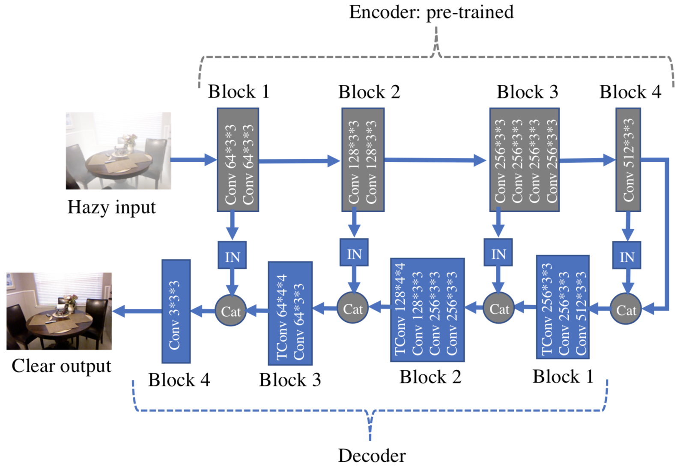
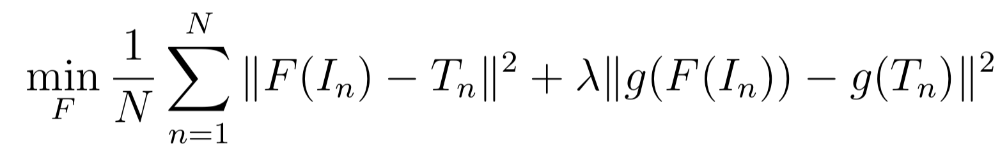
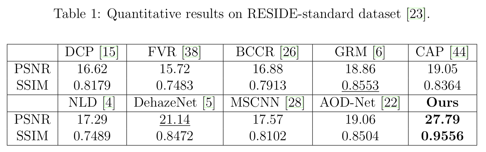

# [The Effectiveness of Instance Normalization: a Strong Baseline for Single Image Dehazing](https://arxiv.org/abs/1805.03305)

[GDrive pdf with notes](https://drive.google.com/file/d/1lJ4CULT2T6LKk9P9Sq2Ikw_m7zzDLty6/view?usp=sharing)

## TDLR

Novel efficient approach for the Dehazing Task (recovering high-quality clear images from degraded images) by using extension of U-Net with the Instance Normalization in skip connetions.

## Notes

### Idea

The overall arch looks as follows:

We use pretrained on ImageNet [VGG](https://arxiv.org/pdf/1409.1556) encoder as first half of custom-made U-Net architecture. The weights of encoder freeze during main training stage, to it operates as good feature extractor.

Decoder designed to be roughly symmetric, but with preserving ability to fine-tune while training. We also apply the Instance Normalization at skip connection stages, so we can effiectevly shift contrast in channels (which is intuitive for dehazing task). The statistics for IN was also precalculated at VGGNet for single image dehazing task.

We also add VGG perceptual loss for getting more smoothly-looking pictures:

### Result

## Afterword

Powerfull (new SOTA) yet simple approach combined with simplicity of U-Net leads to amazing results.

## Links

- [Instance Norm](../1607_instance_normalization)
