# [CBAM: Convolutional Block Attention Module](https://arxiv.org/abs/1807.06521)

[GDrive pdf with notes](https://drive.google.com/file/d/1tw9NxwO_JjM-SeDbejcJ_tTehroStoCa/view?usp=sharing)

## TDLR

A new submodule to insert in deep learning architectures based on attention mechanism that proves it efficiency by ablation studies with score increasing.

## Notes

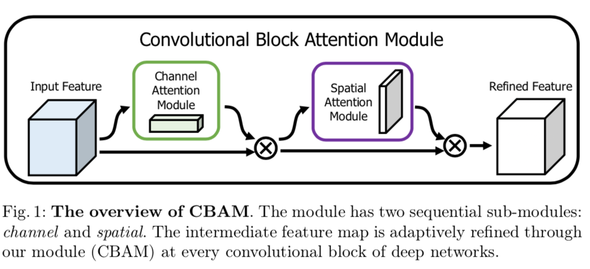

CBAM is, essentially, an attention-based block that goes in between two feature maps and refines feature of input one. The refienment consists of two parts: one for channels and one for spatial information. The order of transformation proved work well just empirically.  

Mathematically, process looks like (we use broad casting here in the numpy sense):

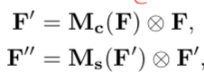  
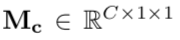  
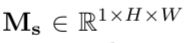

Let's consider channel attention module first. What we gonna do in obtaining channel mask `M_c` using sequence of transformations:

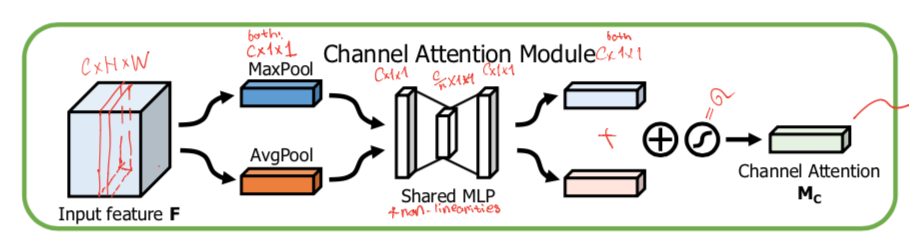

First, ...

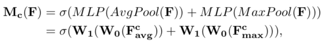

Moving on to the spatial module:

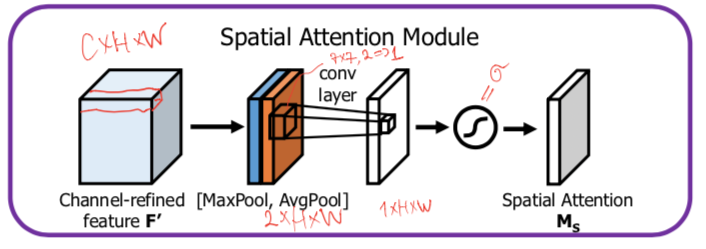

Same thing here, only we dont compress pooling layers into subdimentional one, just doing 7x7 conv following with a sigmoid.  

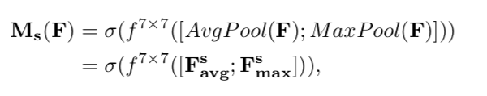

What really interesting here is the fact that we can plug CBAM into RenNet arch along with risidual connection, simultaneously increasing net width and gain an ability to refine it's features.

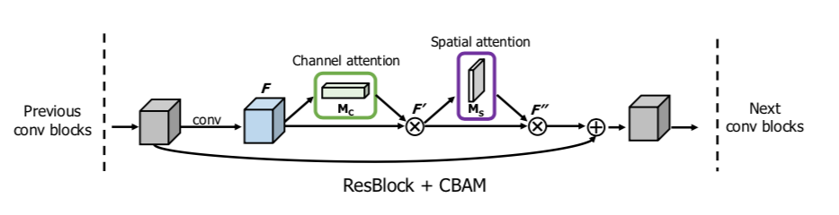

The results split into two major interesting parts. We first, prove the importance of combining poolings, conv params and order of attentions with ablation studies as follows:

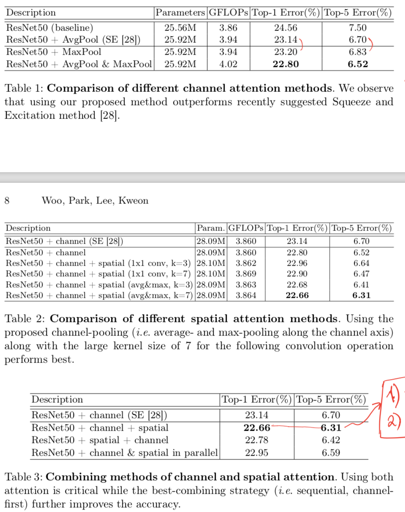

Secondly, they compare results in classification task for ImageNet-1K:

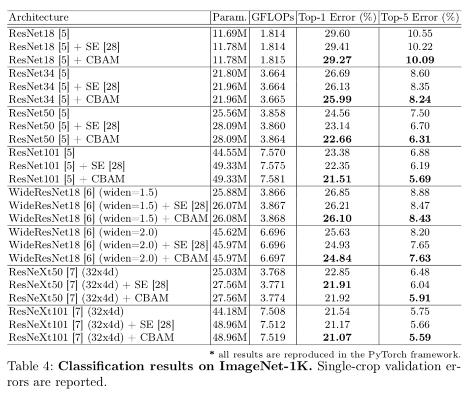

They also got some interpretaion of net performance with nice visualization based on Grad-CAM and got some improvement in object detection task.

## Afterword

The whole arch is really simple and interpretable since we capture channel and spatial information in a understandable way. The result could be a good base for future investigation on attention methods as a way to build architecture.

## Links

- [Attention](https://medium.com/syncedreview/a-brief-overview-of-attention-mechanism-13c578ba9129)
